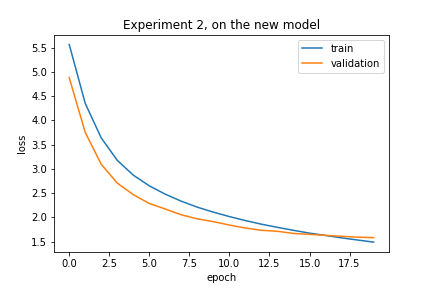

# Training the model
The trained model is closely following the implementation by Fan et al., 2017. Namely, the model and the training pipeline are as follows:
* CNN-based encoder and decoder, kernel size 1x3
* 8 layers each in encoder and decoder
* Vocab-embed layers shared between encoder and decoder (*"we share representation of tokens in encoder and decoder embeddings"*, Fan et. al, 2017)
* Hid-emb final layer shared between encoder and decoder (*"we share representation of tokens ... in last decoder layer"*, Fan et. al, 2017)
* Encoder and decoder connected through (inter-)attention
* Self-attention in decoder
* Attention layers in decoder alternate between self-attention and inter-attention at every layer
* Emb dim: 340, Hid dim: 512
* Total number of parameters in the model: xxx
* Byte-pair-encoding of text for reducing vocab size
* Adam optimizer, starting learning rate 0.2
* Decaying learning rate; decrease by magnitude 10 if val loss not decreasing
* Stop training if learning rate <2e-4

The dataset used for the experiments is CNN / Daily Mail, consisting of pairs of input news stories and output summaries. Dataset statistics are as follows: 

* Train set: xxx, validation set: yyy, test set: zzz
* Vocab size, BPE (=output dim)
* **Stories**:
* * Mean sentence length (in BPE tokens): xxx
* * Minimum length: yyy
* * Maximum length: zzz
* **Summaries**:
* * Mean sentence length (in BPE tokens): xxx
* * Minimum length: yyy
* * Maximum length: zzz

To achieve the finishing condition (val loss < 2e-4), it took XX epochs and approximately YY hours of training. The train and model losses in the figure below. The ROUGE score on the validation set by the end of training is ROUGE-1: x, ROUGE-2: y, ROUGE-L: z; those are obtained with teacher forcing and therefore are not representative of the models independent inference abiity. 

Some sample responses, as produced on the validation set (with teacher forcing):  
* Ground truth: ['a', 'little', 'girl', 'climbing', 'into', 'a', 'wooden', 'playhouse', '.']
* Model inference: ['a', 'little', 'girl', 'climbing', 'in', 'a', 'playhouse', 'out', 'wood', '.', '<eos>']

# Testing without teacher forcing and enforcing length control
To evaluate the inference capacity of the trained model, we run inference on the test set without teacher forcing, i.e. the model does not have access to ground truth at inference time. 
* Number of layers reduced from 10 to 8
* Self-attention added
* Embedding dimension increased from 256 to 340
* SGD optimizer used with learning rate 0.2 decreased when validation loss stops decreasing

While the original implementation by Fan et. al, 2017, had a separate attention and self-attention mechanism for every convolutional layer, for this experiment only one of each was kept due to the relatively small size of the training dataset. Moreover, since the model relies on learning rate reduction, it was trained for 20 rather than 10 epochs.

### Initial failure
After initial run of the experiment, it was observed that the new model is underperforming: while the loss was decreasing and the sequences predicted with teacher forcing were close to perfect, actual inference without teacher forcing led to close to random results. Since the main difference between the setup of the new model in the 1st and 2nd experiments was in the self-attention layer, it was decided to investigate this module. 

### Lacking masks for future time-steps
As pointed out in this [tutorial](https://pytorch.org/tutorials/beginner/transformer_tutorial.html), the future time-steps from the decoder have to be masked when using teacher-forcing. Otherwise, the model cah "cheat" by looking up the needed targets. Therefore, the self-attention module in the implementation was adjusted to include this modification; afterwards, the experimental results suggested satisfactory performance. 

### Debugged experimental results

* | Test Loss: 1.656 | Test PPL:   5.240 |
* Ground truth: ['a', 'man', 'in', 'an', 'orange', 'hat', 'starring', 'at', 'something', '.']
* * New model inference: ['a', 'man', 'in', 'an', 'orange', 'hat', 'is', '<unk>', 'something', '.', '<eos>']
* Ground truth: ['a', 'boston', 'terrier', 'is', 'running', 'on', 'lush', 'green', 'grass', 'in', 'front', 'of', 'a', 'white', 'fence', '.']
* * New model inference: ['a', 'football', 'runner', 'is', 'running', 'across', 'grass', 'grass', 'in', 'front', 'of', 'a', 'white', 'fence', '.', '<eos>']
* Ground truth: ['a', 'girl', 'in', 'karate', 'uniform', 'breaking', 'a', 'stick', 'with', 'a', 'front', 'kick', '.']
* * New model inference: ['a', 'girl', 'in', 'a', 'karate', 'uniform', 'is', 'flipping', 'a', 'board', 'with', 'a', 'kick', '.', '<eos>']  
